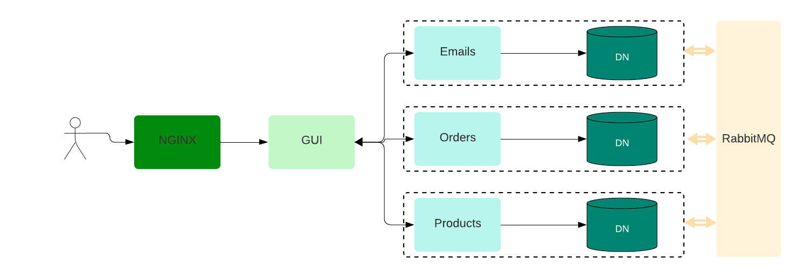

# Django Microservices E-commerce Backend

This project exemplifies a microservices architecture for an e-commerce application using Django. The backend consists of three Django microservices: "Email", "Order", and "Product", each equipped with its own dedicated database. RabbitMQ facilitates asynchronous communication between these microservices. The frontend, developed in React, is containerized, and NGINX acts as a reverse proxy.

## Project Structure

### Diagram

## Microservices

-   `email-service`: Django microservice handling email-related functionalities.
-   `order-service`: Django microservice managing order processing and fulfillment.
-   `product-service`: Django microservice handling product catalog and inventory.

## Databases

Each Django microservice uses its dedicated database. For the sake of this basic template we'll do the databases with SQLite.

## Communication via RabbitMQ

Microservices communicate asynchronously through RabbitMQ, serving as a message broker. Events such as order placement, product updates, and email notifications are exchanged among microservices, ensuring a decoupled architecture.

## Backend Technologies

-   **Django**: The backend microservices are developed using Django, offering a high-level web framework for building robust and scalable applications.
-   **RabbitMQ**: Asynchronous message broker facilitating communication between Django microservices.
-   **PostgreSQL, MongoDB, MySQL**: Databases chosen based on the specific requirements of each Django microservice.

## Frontend

The graphical user interface (GUI) of our application is built with React, offering an intuitive and responsive experience for users interacting with the e-commerce platform.

## NGINX Reverse Proxy

When microservices and the GUI are behind NGINX, communication between them typically involves HTTP-based APIs. NGINX serves as a reverse proxy, routing requests between the GUI and microservices. Here are some best practices for facilitating communication in such a setup:

-   RESTful APIs
-   API versioning
-   Load balancing
-   SSL termination
-   CORS
-   Microservices Authentication and Authorization
-   Request & Response formats
-   Logging & monitoring
-   Rate limiting etc.

## Docker Compose

The entire application is orchestrated using Docker Compose, allowing easy deployment and scaling of the Django microservices and frontend components.

## Getting Started

1. Clone this repository: `git clone https://github.com/darkshloser/microservices-template.git`
2. Navigate to the project directory: `cd microservices-template`
3. Run the application using Docker Compose: `docker-compose up`

Visit the following URLs to interact with different components:

-   Frontend: [http://localhost:80](http://localhost:80)
-   RabbitMQ Management UI: [http://localhost:15672](http://localhost:15672) (Username: `guest`, Password: `guest`)

## License

This project is licensed under the [MIT License](LICENSE).
